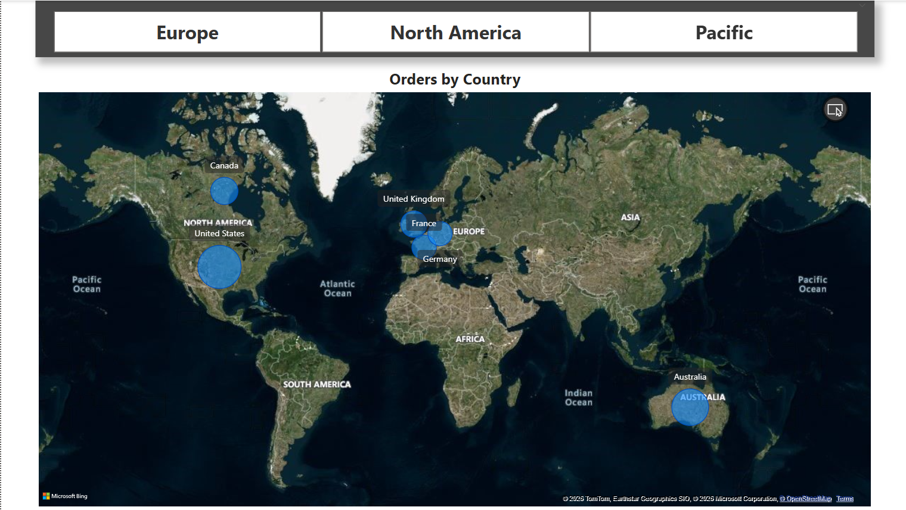
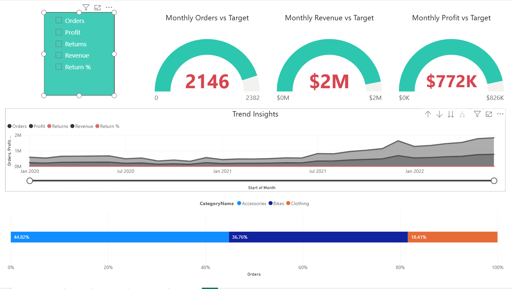
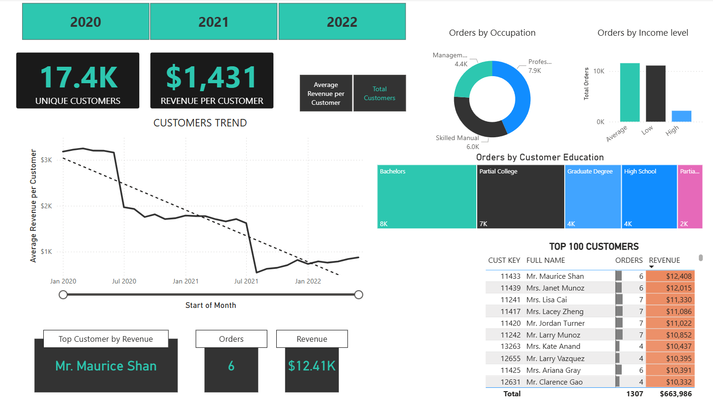

# 📊 Sales Performance Dashboard | Power BI

> An interactive **Power BI dashboard** designed to analyze sales performance across **regions, products, and customer segments**.  
> It provides high-level KPIs along with detailed business insights to support data-driven decision making.

---

## 📸 Dashboard Preview

### Executive Dashboard


### Sales by Region


### Product Performance


### Customer Analysis


---

# 🎯 Project Objective

This dashboard helps business stakeholders:

- Monitor Revenue, Orders, Profit, and Return Rate
- Analyze sales trends over time
- Evaluate product and category performance
- Understand customer purchasing behavior
- Compare actual performance against business targets

---

# 🛠️ Tools & Technologies

- Power BI
- DAX (Data Analysis Expressions)
- Power Query
- Excel / CSV

---

# 🚀 Features

- Interactive slicers (Region, Year)
- Drill-through navigation from Top Products to Product Details
- Dynamic Field Parameters for flexible analysis
- Advanced DAX Measures
  - Time Intelligence
  - Rolling Metrics
  - Target Comparison
- Interactive Maps
- KPI Cards
- Clean and responsive dashboard design

---

# 📊 Dashboard Pages

### 📌 Executive Dashboard
- Revenue Overview
- Profit Analysis
- Orders
- Return Rate
- Monthly Sales Trend

### 🌍 Regional Analysis
- Sales by Region
- Geographic Performance
- Regional Comparison

### 📦 Product Performance
- Top Products
- Product Categories
- Profit Contribution
- Drill-through Analysis

### 👥 Customer Insights
- Customer Segmentation
- Purchasing Behavior
- Sales Distribution
- Customer Performance

---

# 📈 Key Business Insights

- Accessories category generates the highest number of orders.
- Revenue has shown consistent growth after 2021.
- A small group of products contributes significantly to total profit.
- Customer segments display distinct purchasing behaviors.
- Return rate remains low (~2%), indicating strong product satisfaction.

---

# 📁 Project Structure

```
Sales-Performance-Dashboard/
│
├── 📊 Report/
│   └── sales_dashboard.pbix
│
├── 📂 Dataset/
│   └── Sales-Data.xlsx
│
├── 📸 Screenshots/
│   ├── Model View.png
│   ├── Page-1-Main.png
│   ├── Page-2-Map.png
│   ├── Page-3-Products.png
│   └── Page-4-Customers.png
│
├── 📄 Documentation/
│   └── project_documentation.md
│
└── README.md
```

---

# 📖 Documentation

For a detailed explanation of the project, refer to:

**📄 Documentation/project_documentation.md**

---

# 🚀 Getting Started

1. Clone or download this repository.
2. Open **sales_dashboard.pbix** in **Power BI Desktop**.
3. Refresh the data if required.
4. Explore the dashboard using the interactive slicers and visuals.

---

# 💡 Skills Demonstrated

- Data Visualization
- Business Intelligence
- Data Modeling
- DAX
- Power Query
- Dashboard Design
- KPI Reporting
- Interactive Reporting
- Data Analysis

---

## ⭐ If you found this project useful, consider giving it a star!
